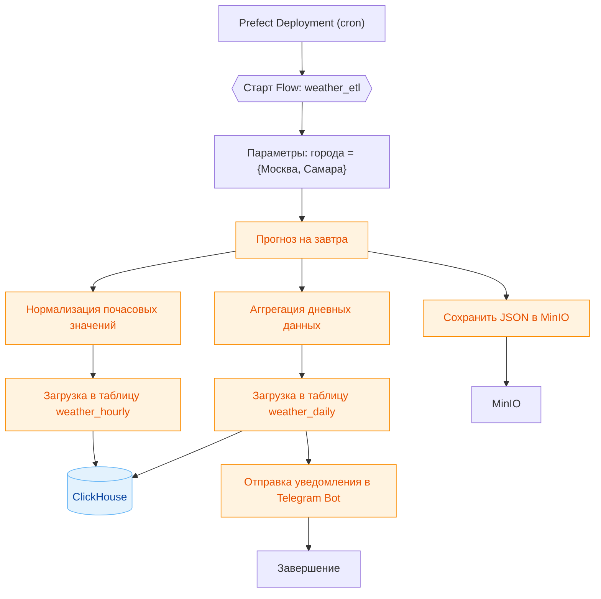

# Задание к лабораторной работе №1

## Цели работы

- На практике освоить полный цикл ETL: извлечение из публичного API, трансформация и загрузка в ClickHouse.

- Научиться собирать и отлаживать пайплайны в **Prefect**.

- Научиться настраивать окружение для работы с данными.

## Описание пайплайна

Заданием на лабораторную работу является реализация следующего пайплайна:

1. В качестве источника данных предлагается использовать [Free Weather API](open-meteo.com)
2. `(Extract)` Получить прогноз **на завтра** по переменным: *температура, осадки, скорость и направление ветра* для городов **Самара и Москва**. Сырые ответы API сохранить в объектном хранилище
3. `(Transform)`
    - Извлечь почасовые значения и нормализовать для таблицы `weather_hourly`
    - Посчитать дневную статистику (min, max, avg температуру и количество осадков) и подготовить для сохранения в таблице `weather_daily`
4. `(Load)` Загрузить преобразованные данные в соответствующие таблицы ClickHouse
5. Автоматически отправить уведомления в Telegram с кратким прогнозом на завтра и предупреждать о сильном ветре/осадках
6. **(Опционально)** Реализовать обработку различных ошибок.

## Используемые инструменты

1. `Perfect` - для реализации ETL пайплайна.
2. `MinIO` - для объектного хранилища.
3. `Clickhouse` - для базы данных.

## Ожидаемый результат

Что должно быть в репозитории:
1. Код пайплайна с использованием `Prefect`.
2. Фрагменты кода инициализации таблиц в `Clickhouse`.
3. `Docker Compose` файл описывающий окружение используемое для выполнения работы.
4. Отчет в формате `.pdf`.

### Требования к отчету

Короткий, но содержательный (до 10`000 символов). 
Рекомендуемая структура:
- Кратко об архитектуре: схема пайплайна, какие инструменты и почему.
- Источник данных: эндпоинт Open‑Meteo, параметры запроса.
- Extract → Transform → Load: по 2–3 предложения на этап.
- Качество данных: какие проверки качества данных реализованы и возможные точки сбоя.
- Результаты: скриншоты/логи `Prefect`, пример содержимого бакета в `MinIO`, фрагменты из weather_hourly/weather_daily (1–2 запросa `ClickHouse`), пример уведомления с прогнозом в `Telegram`.
- Выводы: что было сложным, что бы улучшили.

Требования к оформлению PDF:
Имя файла: report.pdf, шрифт читаемый, 10–12 pt, изображения не «мыльные».

### Pull Request в репозиторий c заданием

Для **сдачи** лабораторной работы:
1. Сделайте fork репозитория с заданием.
2. Залейте код и артефакты (см. список выше). Убедитесь, что репозиторий содержит всё необходимое для сдачи.
3. Откройте PR в исходный репозиторий с заголовком: Lab1: — Фамилия Имя Группа.
4. **Пожалуйста**, используйте `git` для работы с *github*.

### Снижение оценки

Оценка может быть снижена при нарушении следующих правил. Нижеприведённые санкции и примеры — ориентиры; преподаватель оставляет за собой право учитывать контекст.

#### 1) Ручная загрузка файлов в репозиторий
**Что считается нарушением:** загрузка через веб-интерфейс (“Upload files”).

**Как избежать:** используйте `git add/commit/push`, исключайте ненужные файлы и артефакты в `.gitignore`.

#### 2) Спам коммитами
**Что считается нарушением:** серия мелких коммитов без содержательных сообщений и/или осмысленных изменений (например, десятки коммитов подряд вида “fix”, “upd”, правки пробелов).  

**Примеры:**  
- \>10 коммитов за короткий промежуток времени с правками форматирования.  
- Коммиты без описания причины изменений.

**Как избежать:** объединяйте правки (`git add -p`, `git commit --amend`, `git rebase -i`), пишите информативные сообщения коммитов.

#### 3) Плагиат кода или отчёта
**Что считается нарушением:** при подозрении заимствования фрагментов кода/текста без явного указания источника или выдача чужой работы за свою (включая ИИ-генерированный текст без раскрытия факта использования).  

**Штраф:** до 0 баллов за работу; возможна неудовлетворительная оценка по дисциплине. 

**Порядок действий:** при обнаружении плагиата студент вызывается на очную защиту лабораторной работы; по итогам защиты решение по оценке может быть пересмотрено.

